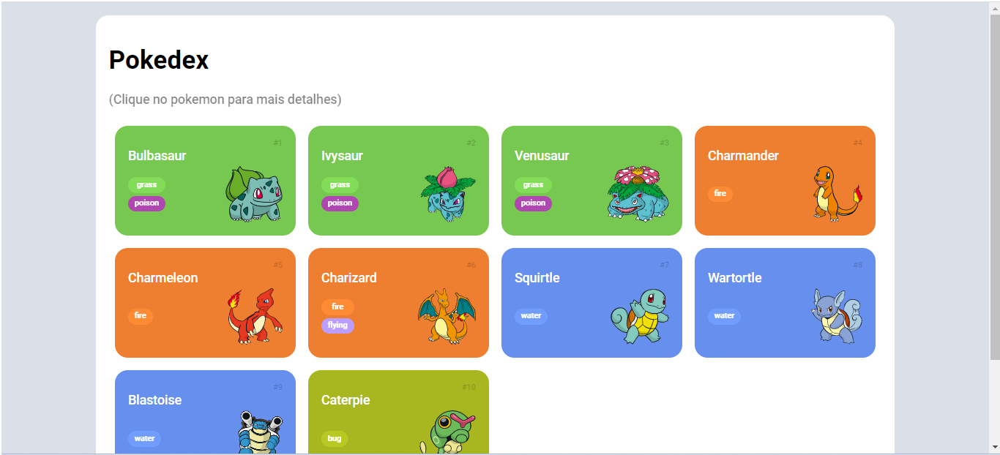

# Desafio Construindo uma Pokédex com JavaScript

Nesse desafio basicamente fiz um incremento na pokedex já criada para saber mais informações sobre o pokemón em questão. Espero que gostem.

## Segue algumas imagens de como ficou o projeto em questão

### Parte 1

### Parte 2

### Parte 3

